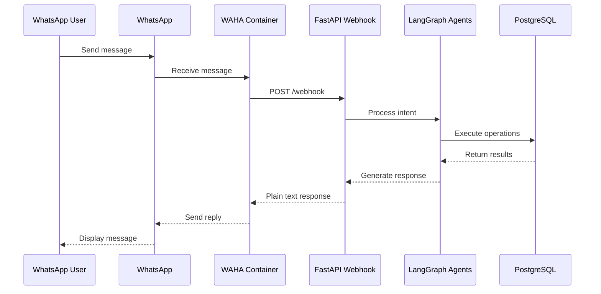

# API Documentation

## Overview

Church Manager v4 exposes a single webhook endpoint that receives messages from WAHA (WhatsApp HTTP API) and returns plain text responses.

## Architecture Flow

## Webhook Endpoint

### POST /webhook

Receives WhatsApp messages via WAHA and processes them through LangGraph agents.

**Endpoint:** `/webhook`  
**Method:** `POST`  
**Content-Type:** `application/json`