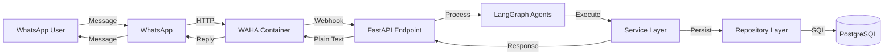
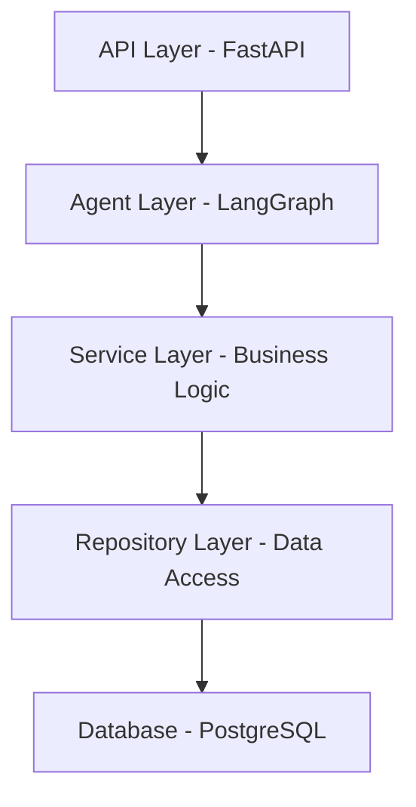

# Architecture Overview

## System Design

Church Manager v4 follows a clean, modular architecture designed for maintainability and scalability within its intended scope.



## Tech Stack

### Core Framework
- **FastAPI**: Modern async Python web framework
  - High performance
  - Automatic API documentation
  - Type hints and validation

### AI Orchestration
- **LangGraph**: Agent workflow management
  - State machine for complex workflows
  - Memory management
  - Intent routing

### Database Layer
- **PostgreSQL**: Relational database
  - ACID compliance
  - Complex relationships support

- **SQLAlchemy**: ORM
  - Declarative models
  - Query builder
  - Connection pooling

- **Alembic**: Database migrations
  - Version control for schema
  - Rollback capabilities

### Data Validation
- **Pydantic v2**: Data validation
  - Request/response schemas
  - Type safety
  - Serialization

### Testing
- **pytest**: Testing framework
  - Fixtures for test data
  - Async test support
  - Coverage reporting

### Package Management
- **Poetry**: Dependency management
  - Lock file for reproducibility
  - Virtual environment handling
  - Easy dependency updates

### WhatsApp Integration
- **WAHA**: WhatsApp HTTP API
  - Dockerized solution
  - Webhook support
  - Multi-session handling

## Architectural Patterns

### Layered Architecture



### Request Flow

1. **Webhook Reception**: FastAPI endpoint receives WAHA payload
2. **Agent Processing**: LangGraph agents interpret message intent
3. **Service Execution**: Business logic processes the request
4. **Data Persistence**: Repository layer handles database operations
5. **Response Generation**: Plain text response sent back via WAHA

## Development Principles

### DRY (Don't Repeat Yourself)
- Shared utilities and helpers
- Reusable components
- Single source of truth for business rules

### KISS (Keep It Simple, Stupid)
- Straightforward implementations
- Avoid premature optimization
- Clear, readable code

### SOLID Principles
- **S**ingle Responsibility: Each module has one purpose
- **O**pen/Closed: Open for extension, closed for modification
- **L**iskov Substitution: Proper inheritance hierarchies
- **I**nterface Segregation: Specific interfaces over general ones
- **D**ependency Inversion: Depend on abstractions, not concretions

## Project Structure

```
church-manager-v4/
├── app/
│   ├── agents/           # LangGraph agent definitions
│   │   ├── __init__.py
│   │   ├── router.py     # Intent routing
│   │   ├── memory.py     # Conversation memory
│   │   └── handlers/     # Specific intent handlers
│   ├── api/             # FastAPI endpoints
│   │   ├── __init__.py
│   │   ├── webhook.py   # WAHA webhook endpoint
│   │   └── deps.py      # Dependencies
│   ├── core/            # Core configuration
│   │   ├── __init__.py
│   │   ├── config.py    # Settings
│   │   └── database.py  # DB connection
│   ├── models/          # SQLAlchemy models
│   │   ├── __init__.py
│   │   ├── user.py
│   │   ├── ministry.py
│   │   └── schedule.py
│   ├── schemas/         # Pydantic schemas
│   │   ├── __init__.py
│   │   ├── waha.py      # WAHA payloads
│   │   └── responses.py
│   ├── services/        # Business logic
│   │   ├── __init__.py
│   │   ├── user.py
│   │   ├── schedule.py
│   │   └── ministry.py
│   └── repositories/    # Data access
│       ├── __init__.py
│       └── base.py
├── tests/              # Test suite
├── alembic/           # Database migrations
├── docs/              # Documentation
├── docker-compose.yml # WAHA + PostgreSQL
├── pyproject.toml     # Poetry configuration
└── main.py           # Application entry point
```

## Scalability Considerations

### Current Scale
- Internal church use
- Few hundred users maximum
- Low message volume
- Single webhook endpoint

### Future Considerations
- Connection pooling for database
- Redis for conversation memory (if needed)
- Async job processing for heavy operations
- Rate limiting per user

## Security

- Environment variables for sensitive data
- Input validation at all layers
- SQL injection prevention via ORM
- HTTPS for webhook endpoint
- Authentication for admin operations

## Monitoring

- Structured logging
- Error tracking
- Performance metrics
- Health check endpoint

## Deployment

- Docker containers
- Environment-based configuration
- Database migration automation
- Zero-downtime deployments