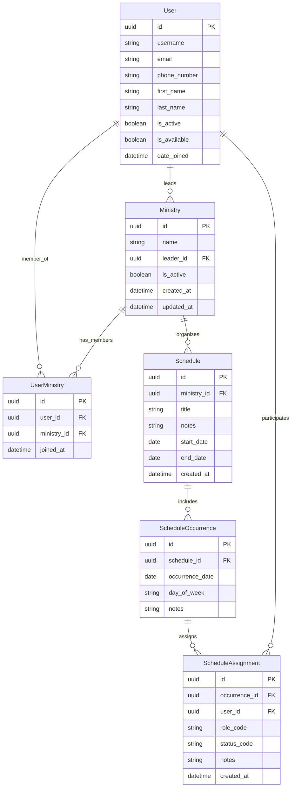

# Database Schema

## Overview

The Church Manager v4 database is designed to manage church volunteers, ministries, schedules, and assignments with a focus on flexibility and data integrity.

## Entity Relationship Diagram



## Entity Descriptions

### User

Central entity representing church members and volunteers.

| Field | Type | Description | Constraints |
|-------|------|-------------|-------------|
| id | UUID | Primary key | Unique, Not Null |
| username | String | Unique identifier for login | Unique, Not Null |
| email | String | Contact email | Unique, Not Null |
| phone_number | String | WhatsApp number | Unique, Not Null |
| first_name | String | User's first name | Not Null |
| last_name | String | User's last name | Not Null |
| is_active | Boolean | Account status | Default: True |
| is_available | Boolean | General availability for scheduling | Default: True |
| date_joined | DateTime | Registration timestamp | Auto-generated |

**Business Rules:**
- Phone number is the primary WhatsApp identifier
- Users can lead multiple ministries
- Users can be members of multiple ministries
- Deactivated users cannot be assigned to new schedules

### Ministry

Represents different service departments or teams within the church.

| Field | Type | Description | Constraints |
|-------|------|-------------|-------------|
| id | UUID | Primary key | Unique, Not Null |
| name | String | Ministry name | Unique, Not Null |
| leader_id | UUID | Reference to User | Foreign Key |
| is_active | Boolean | Ministry status | Default: True |
| created_at | DateTime | Creation timestamp | Auto-generated |
| updated_at | DateTime | Last modification | Auto-updated |

**Business Rules:**
- Each ministry has one leader (can be null initially)
- Inactive ministries cannot create new schedules
- Ministry names must be unique

### UserMinistry

Junction table managing many-to-many relationship between users and ministries.

| Field | Type | Description | Constraints |
|-------|------|-------------|-------------|
| id | UUID | Primary key | Unique, Not Null |
| user_id | UUID | Reference to User | Foreign Key, Not Null |
| ministry_id | UUID | Reference to Ministry | Foreign Key, Not Null |
| joined_at | DateTime | Membership start | Auto-generated |

**Business Rules:**
- User can join same ministry only once
- Tracks when user joined each ministry
- Deletion cascades from User or Ministry

### Schedule

Represents a schedule template for a period (e.g., "December Worship Schedule").

| Field | Type | Description | Constraints |
|-------|------|-------------|-------------|
| id | UUID | Primary key | Unique, Not Null |
| ministry_id | UUID | Reference to Ministry | Foreign Key, Not Null |
| title | String | Schedule name | Not Null |
| notes | String | Additional information | Nullable |
| start_date | Date | Schedule period start | Not Null |
| end_date | Date | Schedule period end | Not Null |
| created_at | DateTime | Creation timestamp | Auto-generated |

**Business Rules:**
- End date must be after start date
- Schedules belong to exactly one ministry
- Can have multiple occurrences within date range

### ScheduleOccurrence

Represents specific dates/events within a schedule (e.g., "Sunday, Dec 10").

| Field | Type | Description | Constraints |
|-------|------|-------------|-------------|
| id | UUID | Primary key | Unique, Not Null |
| schedule_id | UUID | Reference to Schedule | Foreign Key, Not Null |
| occurrence_date | Date | Specific date | Not Null |
| day_of_week | String | Day name (e.g., "Sunday") | Not Null |
| notes | String | Occurrence-specific notes | Nullable |

**Business Rules:**
- Occurrence date must be within schedule's date range
- Day of week auto-calculated from date
- Can have multiple assignments per occurrence

### ScheduleAssignment

Links users to specific roles on specific dates.

| Field | Type | Description | Constraints |
|-------|------|-------------|-------------|
| id | UUID | Primary key | Unique, Not Null |
| occurrence_id | UUID | Reference to ScheduleOccurrence | Foreign Key, Not Null |
| user_id | UUID | Reference to User | Foreign Key, Not Null |
| role_code | String | Role identifier | Not Null |
| status_code | String | Assignment status | Not Null |
| notes | String | Assignment notes | Nullable |
| created_at | DateTime | Assignment timestamp | Auto-generated |

**Role Codes (Examples):**
- `WORSHIP_LEAD` - Worship leader
- `SOUND_TECH` - Sound technician  
- `MEDIA` - Media/projection
- `KIDS_TEACHER` - Kids ministry teacher
- `GREETER` - Greeter/usher

**Status Codes:**
- `ASSIGNED` - Initially assigned
- `CONFIRMED` - User confirmed availability
- `DECLINED` - User declined
- `COMPLETED` - Service completed
- `NO_SHOW` - User didn't show up

**Business Rules:**
- User can have multiple roles on same date (different ministries)
- User cannot have same role twice on same occurrence
- Status transitions follow workflow rules

## Indexes

### Performance Indexes
```sql
-- Frequent lookups
CREATE INDEX idx_user_phone ON user(phone_number);
CREATE INDEX idx_user_active ON user(is_active);
CREATE INDEX idx_ministry_active ON ministry(is_active);
CREATE INDEX idx_schedule_dates ON schedule(start_date, end_date);
CREATE INDEX idx_occurrence_date ON schedule_occurrence(occurrence_date);
CREATE INDEX idx_assignment_status ON schedule_assignment(status_code);

-- Foreign key indexes
CREATE INDEX idx_ministry_leader ON ministry(leader_id);
CREATE INDEX idx_user_ministry_user ON user_ministry(user_id);
CREATE INDEX idx_user_ministry_ministry ON user_ministry(ministry_id);
CREATE INDEX idx_schedule_ministry ON schedule(ministry_id);
CREATE INDEX idx_occurrence_schedule ON schedule_occurrence(schedule_id);
CREATE INDEX idx_assignment_occurrence ON schedule_assignment(occurrence_id);
CREATE INDEX idx_assignment_user ON schedule_assignment(user_id);
```

## Data Integrity

### Constraints

1. **Unique Constraints**
   - User: username, email, phone_number
   - Ministry: name
   - UserMinistry: (user_id, ministry_id) composite
   - ScheduleAssignment: (occurrence_id, user_id, role_code) composite

2. **Check Constraints**
   ```sql
   -- Schedule date validation
   ALTER TABLE schedule 
   ADD CONSTRAINT check_schedule_dates 
   CHECK (end_date >= start_date);
   
   -- Occurrence date validation
   ALTER TABLE schedule_occurrence
   ADD CONSTRAINT check_occurrence_in_range
   CHECK (occurrence_date >= schedule.start_date 
          AND occurrence_date <= schedule.end_date);
   ```

3. **Referential Integrity**
   - All foreign keys have CASCADE DELETE where appropriate
   - Ministry leader can be NULL (for new ministries)

## Migration Strategy

### Initial Setup
```sql
-- Run Alembic migrations
alembic upgrade head
```

### Common Operations

```sql
-- Find all available users for a date
SELECT u.* FROM user u
WHERE u.is_active = true 
  AND u.is_available = true
  AND u.id NOT IN (
    SELECT sa.user_id 
    FROM schedule_assignment sa
    JOIN schedule_occurrence so ON sa.occurrence_id = so.id
    WHERE so.occurrence_date = '2024-01-07'
      AND sa.status_code != 'DECLINED'
  );

-- Get ministry schedule for a month
SELECT 
  so.occurrence_date,
  so.day_of_week,
  u.first_name,
  u.last_name,
  sa.role_code,
  sa.status_code
FROM schedule_occurrence so
JOIN schedule s ON so.schedule_id = s.id
LEFT JOIN schedule_assignment sa ON so.id = sa.occurrence_id
LEFT JOIN user u ON sa.user_id = u.id
WHERE s.ministry_id = ?
  AND so.occurrence_date BETWEEN '2024-01-01' AND '2024-01-31'
ORDER BY so.occurrence_date, sa.role_code;
```

## Future Considerations

### Potential Enhancements

1. **Availability Table**: Specific dates when users are unavailable
2. **Role Table**: Normalize role codes with descriptions
3. **Notification Log**: Track WhatsApp notifications sent
4. **Audit Trail**: Track all changes for compliance
5. **Preferences**: User preferences for roles and schedules

### Scalability

- Partition large tables by date (schedule_occurrence, schedule_assignment)
- Archive old schedules after certain period
- Consider read replicas for reporting queries
- Implement caching layer for frequent queries