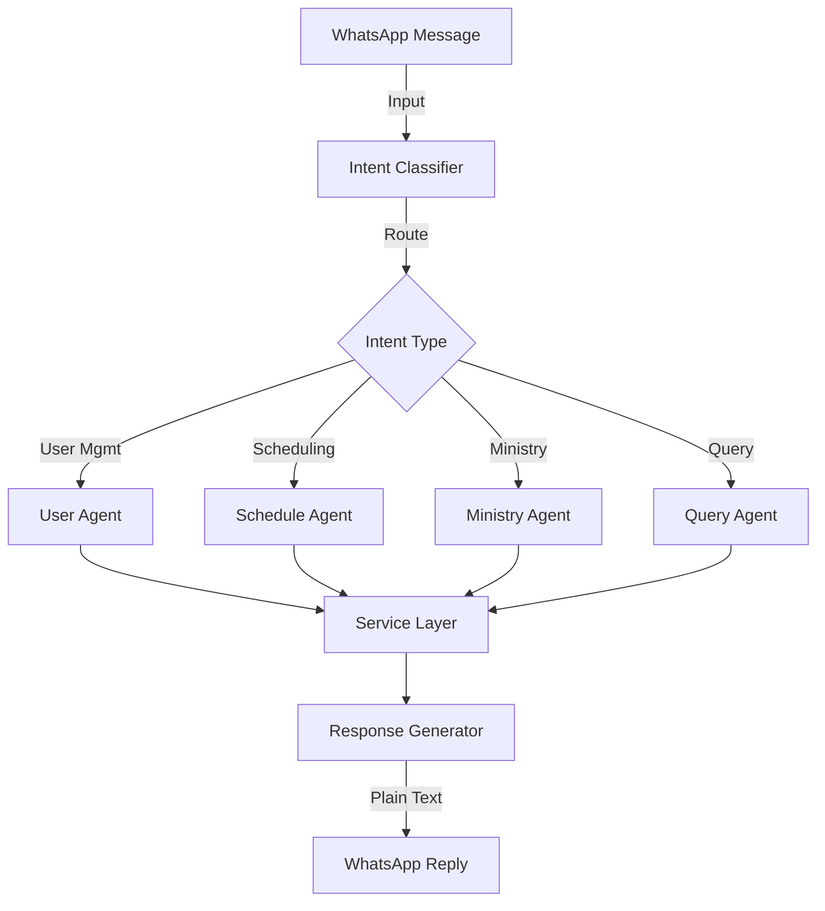
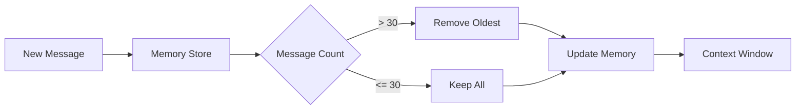
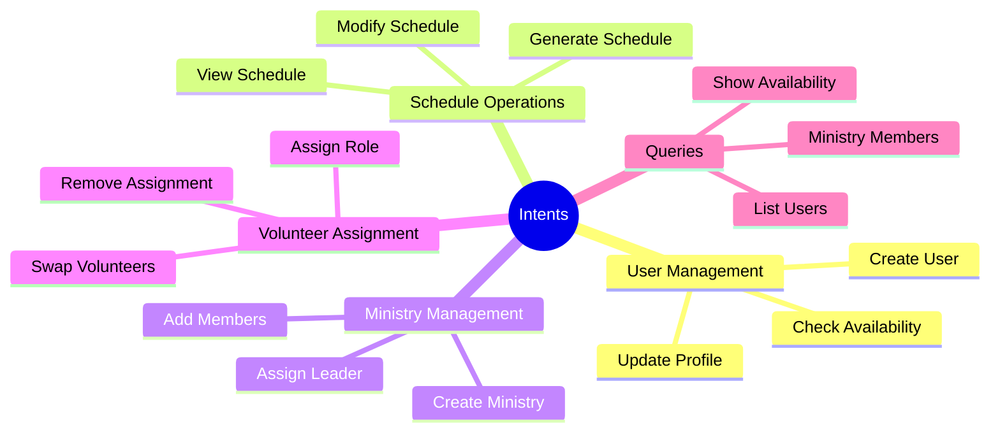
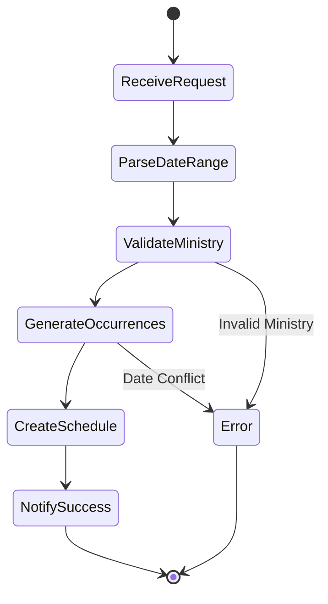
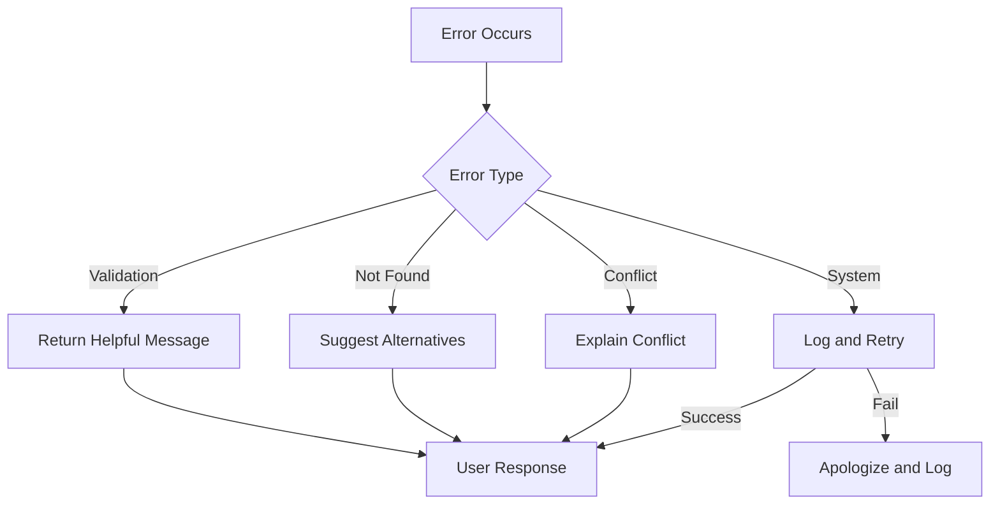
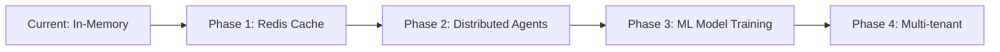

# LangGraph Agent System

## Overview

Church Manager v4 leverages LangGraph to create a sophisticated agent-based system that processes natural language messages from WhatsApp users and executes appropriate actions.

## Core Concept



## Agent Architecture

### State Management

```python
from typing import TypedDict, List
from langgraph.graph import StateGraph

class ConversationState(TypedDict):
    messages: List[dict]          # Last 30 messages
    current_intent: str           # Identified intent
    entities: dict               # Extracted entities
    user_context: dict           # User session data
    response: str               # Generated response
```

### Memory System

The system maintains conversation memory to provide context-aware responses:



#### Memory Strategy
- **Capacity**: Last 30 messages per user
- **Priority**: Recent 2-3 messages have highest weight
- **Storage**: In-memory with Redis backup (future)
- **Retention**: Session-based with timeout

## Intent Recognition

### Intent Categories



### Intent Processing Pipeline

1. **Message Reception**
   ```python
   async def process_message(message: str, user_id: str):
       # Load conversation history
       history = await load_conversation(user_id)
       
       # Add new message
       history.append(message)
       
       # Extract intent and entities
       intent, entities = await classify_intent(message, history)
       
       # Route to appropriate agent
       result = await route_to_agent(intent, entities, history)
       
       # Generate response
       response = await format_response(result)
       
       return response
   ```

2. **Entity Extraction**
   - User names
   - Dates and date ranges
   - Ministry names
   - Role types
   - Time expressions (e.g., "next month", "all Sundays")

3. **Context Enhancement**
   - Previous conversation context
   - User preferences
   - Default values
   - Implicit references resolution

## Agent Workflows

### Schedule Generation Agent



### User Assignment Agent

```python
class AssignmentAgent:
    async def process(self, state: ConversationState):
        # Extract assignment details
        user = state.entities.get("user")
        date = state.entities.get("date")
        role = state.entities.get("role")
        
        # Validate user availability
        if not await check_availability(user, date):
            return "User not available on that date"
        
        # Check for conflicts
        conflicts = await check_conflicts(user, date)
        if conflicts:
            return f"User already assigned to {conflicts}"
        
        # Create assignment
        assignment = await create_assignment(user, date, role)
        
        return f"Successfully assigned {user} as {role} on {date}"
```

## Natural Language Understanding

### Pattern Recognition

Examples of understood patterns:

```yaml
Schedule Creation:
  - "Create schedule for December"
  - "Generate all Sunday services next month"
  - "Set up worship team for Christmas week"

User Assignment:
  - "Put John on sound this Sunday"
  - "Maria can do kids ministry on the 15th"
  - "Who's available for worship next week?"

Queries:
  - "Show me the schedule"
  - "Who's serving this Sunday?"
  - "List all worship team members"
```

### Contextual Understanding

The system understands context and pronouns:

```
User: "Create schedule for January"
Bot: "Created 4 Sunday services for January"
User: "Add João to the first one"  # "first one" understood as first Sunday
Bot: "João added to January 7th service"
```

## Response Generation

### Response Templates

Responses are generated based on action results:

```python
RESPONSE_TEMPLATES = {
    "schedule_created": "Created {count} {day} services for {month}",
    "user_assigned": "{user} assigned to {role} on {date}",
    "user_created": "New user {name} added successfully",
    "error": "Sorry, {error_message}. Please try again."
}
```

### Formatting Rules

- Keep responses concise
- Use natural language
- Include relevant details
- Confirm actions taken
- Suggest next steps when appropriate

## Error Handling



## Performance Optimization

### Strategies

1. **Parallel Processing**: Multiple agents can work simultaneously
2. **Caching**: Common queries cached for quick response
3. **Lazy Loading**: Load user context only when needed
4. **Batch Operations**: Group database operations

### Monitoring

Key metrics to track:
- Intent classification accuracy
- Response time per intent type
- Memory usage per user
- Error rates by agent

## Future Enhancements

### Planned Features

1. **Multi-language Support**: Portuguese and English
2. **Voice Messages**: Process audio messages
3. **Proactive Notifications**: Remind users of assignments
4. **Learning System**: Improve intent recognition over time
5. **Advanced Queries**: Complex reporting and analytics

### Scalability Path



## Integration with LangGraph

### Graph Definition

```python
from langgraph.graph import StateGraph, END

# Define the graph
workflow = StateGraph(ConversationState)

# Add nodes
workflow.add_node("classify_intent", classify_intent_node)
workflow.add_node("user_agent", user_agent_node)
workflow.add_node("schedule_agent", schedule_agent_node)
workflow.add_node("ministry_agent", ministry_agent_node)
workflow.add_node("query_agent", query_agent_node)
workflow.add_node("response_generator", response_generator_node)

# Add edges based on intent
workflow.add_conditional_edges(
    "classify_intent",
    route_by_intent,
    {
        "user": "user_agent",
        "schedule": "schedule_agent",
        "ministry": "ministry_agent",
        "query": "query_agent",
    }
)

# All agents lead to response generator
workflow.add_edge("user_agent", "response_generator")
workflow.add_edge("schedule_agent", "response_generator")
workflow.add_edge("ministry_agent", "response_generator")
workflow.add_edge("query_agent", "response_generator")

# Response generator ends the flow
workflow.add_edge("response_generator", END)

# Set entry point
workflow.set_entry_point("classify_intent")

# Compile
app = workflow.compile()
```

This architecture ensures clean separation of concerns, maintainable code, and scalable agent-based processing.